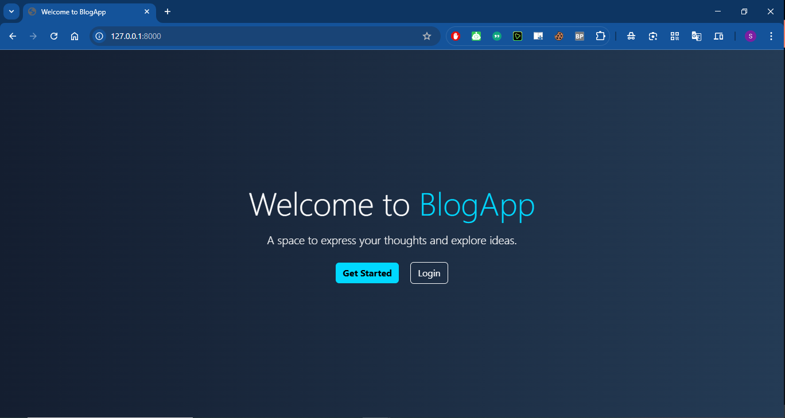
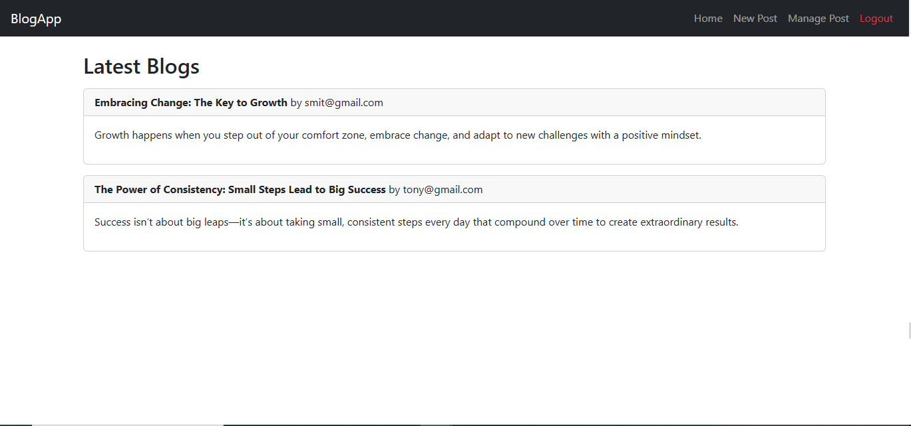
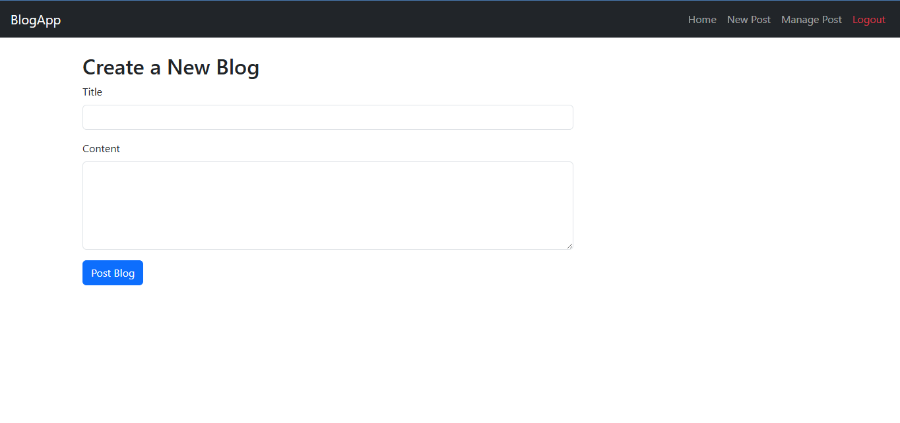
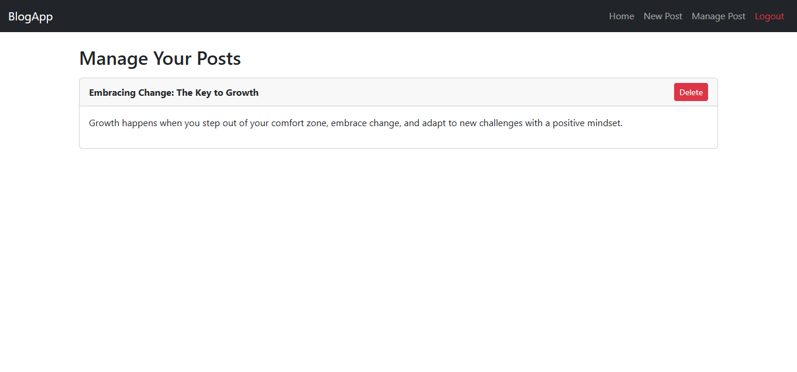

# 📝 FastAPI Blog App

A **secure, real-time blog application** built with **FastAPI, Jinja2, and MongoDB**, featuring **JWT authentication**, **Socket.IO WebSockets**, and **dynamic blog management**.

## 🚀 Features

- ✅ **JWT-based authentication** (Signup/Login/Logout)
- ✅ **Create, Manage & Delete Blog Posts**
- ✅ **Real-time post updates** via WebSockets
- ✅ **Secure Password Hashing** using `bcrypt`
- ✅ **Responsive UI** with Bootstrap & Jinja2 templating
- ✅ **MongoDB (Motor) integration** for scalability
- ✅ **Optimized static script loading** for better performance

---

## 📦 Installation

### 1️⃣ **Clone the Repository**
```sh
git clone https://github.com/YOUR_USERNAME/fastapi-blog-app.git
cd fastapi-blog-app
```

### 2️⃣ **Create a Virtual Environment**
```sh
python -m venv venv
source venv/bin/activate  # On macOS/Linux
venv\Scripts\activate      # On Windows
```

### 3️⃣ **Install Dependencies**
```sh
pip install -r requirements.txt
```

### 4️⃣ **Setup Environment Variables**
Create a `.env` file in the root directory:
```ini
SECRET_KEY=your-secure-key
ALGORITHM=HS256
ACCESS_TOKEN_EXPIRE_MINUTES=30
MONGODB_URL=mongodb://localhost:27017
```

---

## 🏃‍♂️ Running the Application

### **Start the FastAPI Server**
```sh
uvicorn main:app --reload
```

- Visit **`http://127.0.0.1:8000/`** to access the app.
- Interactive API Docs: **`http://127.0.0.1:8000/docs`**

---

## 🛠️ Project Structure

```
fastapi-blog-app/
│── main.py              # FastAPI Backend
│── templates/           # Jinja2 Templates (HTML)
│   ├── index.html
│   ├── login.html
│   ├── signup.html
│   ├── manage_posts.html
│── static/              # CSS, JS, Assets
│── .env                 # Environment Variables
│── requirements.txt     # Python Dependencies
│── README.md            # Documentation
```

---

## 🔧 API Endpoints

| Method | Endpoint         | Description                  |
|--------|-----------------|------------------------------|
| `POST` | `/token`        | User Login                   |
| `POST` | `/signup`       | Register New User            |
| `GET`  | `/home`         | View All Blogs               |
| `POST` | `/create`       | Create New Blog              |
| `GET`  | `/manage`       | Manage User's Own Blogs      |
| `POST` | `/delete_post/{post_id}` | Delete a Blog      |
| `GET`  | `/logout`       | Logout User                  |

---

## 🎨 Screenshots

| Main Page | Home Page |
|-----------|-------------|
|  |  |

| New Posts | Manage Posts |
|-----------|-------------|
|  |  |


---

## 🤝 Contributing

1. **Fork the repository** 🍴
2. **Create a feature branch** (`git checkout -b feature-name`)
3. **Commit changes** (`git commit -m "Added new feature"`)
4. **Push to GitHub** (`git push origin feature-name`)
5. **Create a Pull Request** ✅

---

## 📜 License

This project is **MIT Licensed**. See [LICENSE](LICENSE) for details.

---

## ⭐ Like this project?

- 🌟 **Star this repository** on GitHub!
- 💬 **Share feedback** by opening an **Issue**.

---
